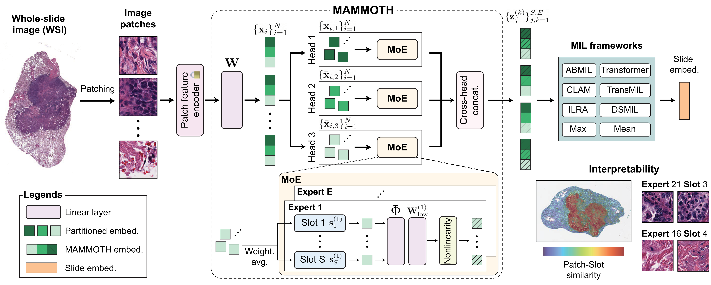
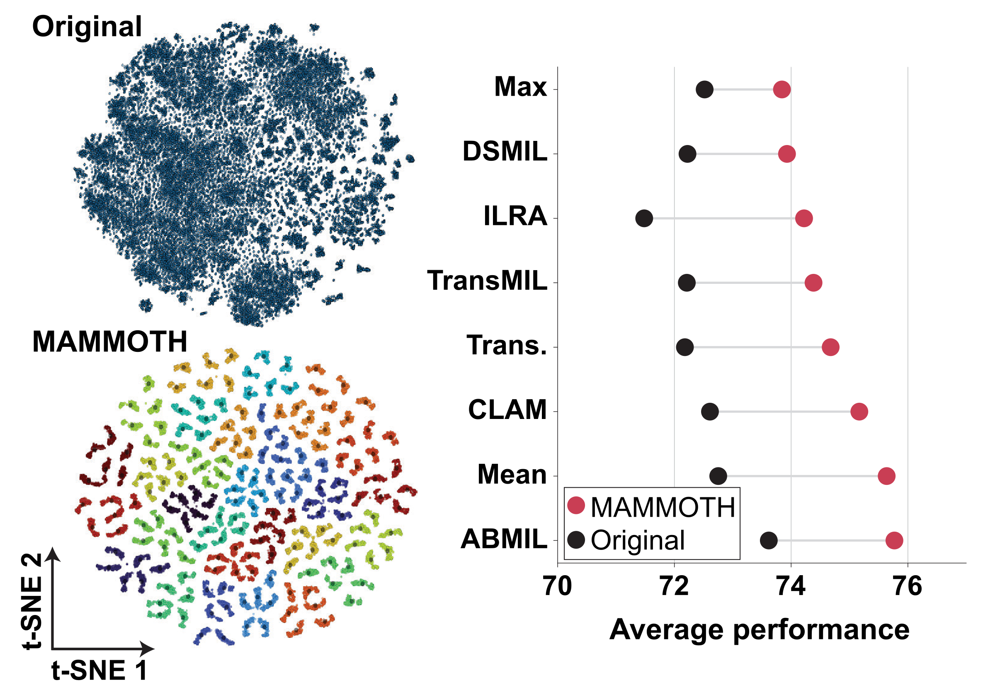

# Mammoth: Mixture of Mini Experts in Pathology

[](https://pypi.org/project/mammoth-moe/)
[](https://creativecommons.org/licenses/by-nc-nd/4.0/)


<b>Mixture of Mini Experts: Overcoming the Linear Layer Bottleneck in Multiple Instance Learning</b>, ICLR 2026.  
*[Daniel Shao](https://www.linkedin.com/in/daniel-shao-833927181/), [Joel Runevic](https://www.linkedin.com/in/joelrunevic/), [Richard J. Chen](https://www.linkedin.com/in/richardchen95/), [Drew F. K. Williamson](https://www.linkedin.com/in/drew-williamson-md/), [Ahrong Kim](https://www.researchgate.net/scientific-contributions/Ahrong-Kim-2284298092), [Andrew H. Song](https://www.linkedin.com/in/andrewhsong/)\*, [Faisal Mahmood](https://faisal.ai/)\**

*A parameter-efficient, plug-and-play mixture of experts for multiple instance learning models in computational pathology*  
[Paper](https://openreview.net/pdf?id=S5Io33pc78) | [OpenReview](https://openreview.net/forum?id=S5Io33pc78) | [Citation](#Citation)


---

## How does Mammoth work?
<div align="center">
  
</div>
&nbsp;

### Key Ideas
In Multiple Instance Learning (MIL) for whole-slide images, the standard pipeline is:

1. **Extract** patch features (e.g. from a pretrained encoder),
2. **Transform** them with a **linear layer** into task-specific patch features,
3. **Aggregate** patches into a slide-level representation for classification.

Most works focus on (1) and (3). Mammoth explicitly targets (2): it **replaces the single linear layer** with a **low-rank mixture of experts** such that each patch gets a transformation tailored to its phenotype. This is done with a comparable number of parameters as the original linear layer.

- **Low-rank:** Each expert is a factorized (LoRA-style) linear layer, keeping the parameter count close to a single linear layer.
- **Mixture of experts:** Slot-based routing assigns each patch to a combination of experts; the final representation is a weighted combination of expert outputs.
- **Plug-and-play:** Drop-in replacement for the patch embedding linear layer in any MIL method. Works with mean/max pooling, attention, CLAM, TransMIL, and others.


<details>
  <summary>
	  <b>Main Findings (click to expand) </b>
  </summary>

	
- **Improved performance:** Across 8 MIL methods and 19 classification tasks, Mammoth improves performance in 130/152 configurations with an average **+3.8%** change, and often has a larger effect than the choice of aggregation method. Shown is the average performance per MIL method, averaged across all tasks
- **Structured Feature Space:** Mammoth yields a structured feature space, with outputs forming distinct clusters per expert, and subclusters per slot.
- **Expert specialization:** Mammoth experts focus on diverse morphological phenotypes, enabling context-specific processing
- **Mitigated Instance-Gradient Intereference:** Heterogeneous instances yield conflicting gradient updates for the standard linear layer, which is mitigated by Mammoth's expert routing.  
</details>

**Representative performance**
| MIL Model | Linear<br>(Morph, T=6) | Mammoth<br>(Morph, T=6) | Linear<br>(Molec, T=13) | MAMMOTH<br>(Molec, T=13) |
|:---|:---:|:---:|:---:|:---:|
| **ABMIL** | 75.2 | 78.4 | 72.8 | 74.6 |
| **CLAM** | 71.7 | 78.5 | 72.9 | 73.7 |
| **TransMIL** | 72.8 | 76.5 | 72.2 | 73.7 |
| **Transformer** | 73.5 | 77.5 | 71.8 | 74.2 |
| **ILRA** | 71.5 | 77.7 | 71.6 | 72.8 |
| **MeanMIL** | 72.5 | 77.0 | 72.6 | 74.5 |
| **MaxMIL** | 71.9 | 74.8 | 72.9 | 74.1 |
| **DSMIL** | 72.7 | 75.6 | 72.1 | 73.3 |

Shown is average performance for the linear layer vs. Mammoth across different MIL methods with UNI patch features. Balanced accuracy is reported for morphological subtyping tasks, and AUROC is reported for molecular subtyping tasks. 

## Installation

Install via pip

```bash
pip install mammoth-moe
```

or from source

```bash
git clone https://github.com/mahmoodlab/MAMMOTH.git
cd mammoth_draft
pip install -e .
```

The [mammoth.py](./src/mammoth/mammoth.py) module only depends on:

- **PyTorch**
- **einops**

For quickstart instructions to use the MIL models in this repository, including environment setup, please see the [MIL-Lab](https://github.com/mahmoodlab/MIL-Lab)

---

## Minimal example: adding Mammoth to any MIL model

Mammoth is a drop-in replacement for the **first linear layer** that maps patch features to the dimension used by the rest of your MIL model. Below, a simple mean-pooling MIL model uses either a linear layer or Mammoth:

```python
import torch
import torch.nn as nn
from mammoth import Mammoth

class MeanMIL(nn.Module):
    def __init__(self, in_dim, out_dim, num_classes, moe_args={}):
        super().__init__()
        if moe_args and moe_args.get('num_experts', 0) > 0:
            self.fc = Mammoth(**moe_args)
        else:
            self.fc = nn.Linear(in_dim, out_dim)
        self.classifier = nn.Linear(out_dim, num_classes)

    def forward(self, x):
        # x: (batch, num_patches, in_dim)
        x = self.fc(x)           # -> (batch, num_patches, out_dim)
        x = torch.mean(x, dim=1) # aggregate
        return self.classifier(x)


in_dim = 1024   # e.g. patch feature dimension from a backbone
dim = 512       # dimension for aggregation / classifier
num_classes = 3

# our recommended hyperparameters for MAMMOTH
moe_args = {
    "input_dim": in_dim,
    "dim": dim,
    "num_experts": 30,  
    "num_slots": 10,
    "num_heads": 16,
    "slot_dim": 256,
    "keep_slots": True,  # if True, return the E*S aggregated features instead of the N transformed patch features
    "share_lora_weights": True,  # share the weights of the first low rank layer 
    "dropout": 0.1,
    "auto_rank": True,   # automatically calculate the appropriate low rank for parameter efficiency
}

model = MeanMIL(in_dim, dim, num_classes, moe_args=moe_args)
x = torch.randn(2, 1000, in_dim)
logits = model(x)  # (2, num_classes)
```
> [!Note]
> Mammoth is intended to be a drop-in replacement for the linear layer at comparable parameter counts. While `num_experts`, `num_slots`, and `num_heads` may be adjusted, we strongly recommend setting `share_weights=True` and `auto_rank=True` to automatically compute the appropriate layer sizes.

---
## Viewing Expert Specialization

&nbsp;

The routing scores for heatmaps can be generated via the parameter `return_weights`.

```python
input = torch.randn(B, N, H * D)

# out is B (SE) (HD)
out = model.patch_embed(input)  

# routing_weights is B N E S H D
out, routing_weights = model.patch_embed(input, return_weights=True) 
```

For starter code to generate your own visualizations with the routing scores, please see [this script](./examples/tutorial_mammoth_visualization.py)

## Full MIL models

Enabling Mammoth requires passing a `moe_args` dict with `num_experts > 0` and the usual Mammoth arguments (`num_experts`, `input_dim`, `dim`, `num_heads`, etc.). If `moe_args` is empty or `num_experts == 0`, the model uses the original linear layer.

**Example: ABMIL with Mammoth**

```python
from millab.src.models.abmil import ABMIL, ABMILGatedBaseConfig, ABMILModel

# minimal args needed to initialize MAMMOTH. This will create 30 experts, 16 heads, 10 slots/expert, weight sharing
moe_args = {
	"num_experts": 30
} 

config = ABMILGatedBaseConfig(
    in_dim=1024,
    embed_dim=512,
    num_classes=2,
    moe_args=moe_args,
)
model = ABMILModel(config)
# Forward: (B, M, D) patch features -> logits, loss, etc.
```


MIL models with mammoth can also be instantiated with MIL-Lab's `create_model` method by specifying the `base_mammoth` config:
```python
from millab.src.builder import create_model

# standard abmil model with linear layer and uni's 1024 input dimension
create_model('abmil.base.uni', num_classes=5)

# use standard abmil with mammoth
create_model('abmil.base_mammoth.uni', num_classes=5)

# Specify the encoder to automatically update the input dimension
create_model('abmil.base_mammoth.conch_v15', num_classes=5) 
```
The following MIL implementations are available. This allows the **`patch_embed`** layer to be optionally equipped with Mammoth by passing `moe_args` into the model class, or with `create_model`. 
| Model | Code | Paper | Model Class | Initialization |
|:---|:---|:---|:---|:---|
| ABMIL | [Link](./MIL-Lab/src/models/abmil.py) | [Link](https://arxiv.org/abs/1802.04712) | `ABMILModel()` | `create_model('abmil.base_mammoth')`|
| TransMIL | [Link](./MIL-Lab/src/models/transmil.py) | [Link](https://proceedings.neurips.cc/paper/2021/hash/10c272d06794d3e5785d5e7c5356e9ff-Abstract.html) | `TransMILModel()` | `create_model('transmil.base_mammoth')`|
| Transformer | [Link](./MIL-Lab/src/models/transformer.py) | [Link](https://arxiv.org/abs/1706.03762) | `TransformerModel()` |  `create_model('transformer.base_mammoth')`|
| WiKG | [Link](./MIL-Lab/src/models/wikg.py) | [Link](https://arxiv.org/abs/2403.07719) | `WIKGMILModel()` |  `create_model('wikg.base_mammoth')`|
| DFTD | [Link](./MIL-Lab/src/models/dftd.py) | [Link](https://openaccess.thecvf.com/content/CVPR2022/papers/Zhang_DTFD-MIL_Double-Tier_Feature_Distillation_Multiple_Instance_Learning_for_Histopathology_Whole_CVPR_2022_paper.pdf) | `DFTDModel()` |  `create_model('dftd.base_mammoth')`|
| DSMIL| [Link](./MIL-Lab/src/models/dsmil.py) | [Link](https://arxiv.org/abs/2011.08939) | `DSMILModel()` |  `create_model('dsmil.base_mammoth')`|
| ILRA | [Link](./MIL-Lab/src/models/ilra.py) | [Link](https://openreview.net/pdf?id=01KmhBsEPFO) | `ILRAModel()`|  `create_model('ilra.base_mammoth')`|
| RRT | [Link](./MIL-Lab/src/models/rrt.py) | [Link](https://arxiv.org/abs/2402.17228) | `RRTMILModel()`|  `create_model('rrt.base_mammoth')`|
| CLAM | [Link](./MIL-Lab/src/models/clam.py) | [Link](https://www.nature.com/articles/s41551-020-00682-w) | `CLAMModel()` |  `create_model('clam.base_mammoth')`|

---

## Repository layout

| Path | Description |
|------|-------------|
| `modules/mammoth.py` | Core Mammoth module: `Mammoth`, factorized experts, slot routing, and supporting layers |
| `modules/components.py` | Shared utilities (e.g. `ensure_batched`) used by `mammoth.py` |
| `MIL-Lab/src/models/` | MIL model wrappers (ABMIL, CLAM, DSMIL, TransMIL, etc.) with optional Mammoth patch embedding |
| `examples/tutorial_mammoth_visualization.py` | Expert dispatch heatmaps on WSIs using a saved Mammoth checkpoint |
| `config/paths.py` | Central path mappings for tasks and WSI/feature directories |

---
## Issues

- The preferred mode of communication is via GitHub issues.
- If GitHub issues are inappropriate, email dshao@mit.edu and asong2@mdanderson.org

## Funding
This work was funded by NIH NIGMS R35GM138216.

## License and Terms of Use
ⓒ Mahmood Lab. This repository is released under the CC-BY-NC-ND 4.0 license and may only be used for non-commercial, academic research purposes with proper attribution. Any commercial use, sale, or other monetization of this repository is prohibited and requires prior approval. By downloading any pretrained encoder, you agree to follow the model's respective license.

## Acknowledgements
The project was built on top of amazing repositories such as [HuggingFace](https://huggingface.co/docs/datasets/en/index) and open-source contributions for all MIL models from the community. We thank the authors and developers for their contribution. 

## Citation

If you use this code, the Mammoth method, or the MIL model implementations in your work, please cite:

```bibtex
@inproceedings{shao2026mammoth,
  title={Mixture of Mini Experts: Overcoming the Linear Layer Bottleneck in Multiple Instance Learning},
  author={Shao, Daniel and Runevic, Joel and Chen, Richard J. and Williamson, Drew F. K. and Kim, Ahrong and Song, Andrew H. and Mahmood, Faisal},
  booktitle={International Conference on Learning Representations (ICLR)},
  year={2026},
  url={https://openreview.net/forum?id=S5Io33pc78}
}

@inproceedings{shao2025do,
    title={Do Multiple Instance Learning Models Transfer?},
    author={Shao, Daniel and Chen, Richard J and Song, Andrew H and Runevic, Joel and Lu, Ming Y. and Ding, Tong and and Mahmood, Faisal},
    booktitle={International conference on machine learning},
    year={2025},
}
```

---

## License

See the repository for license information. The paper is under CC BY 4.0.


 
